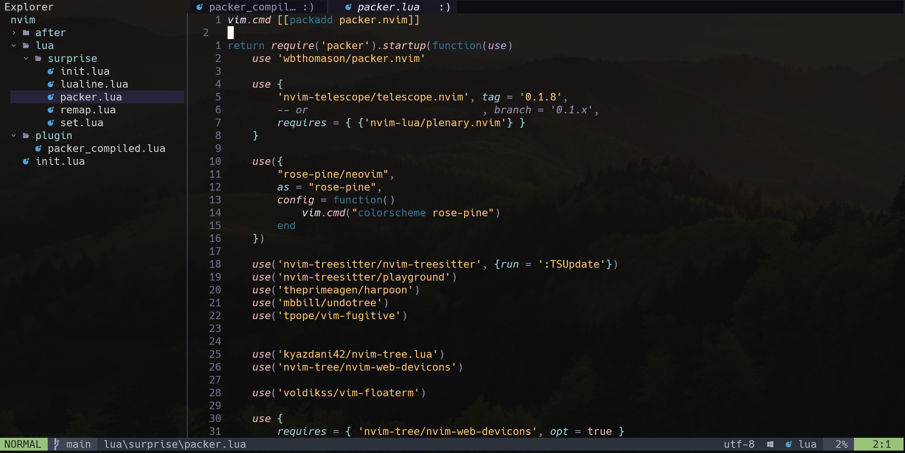
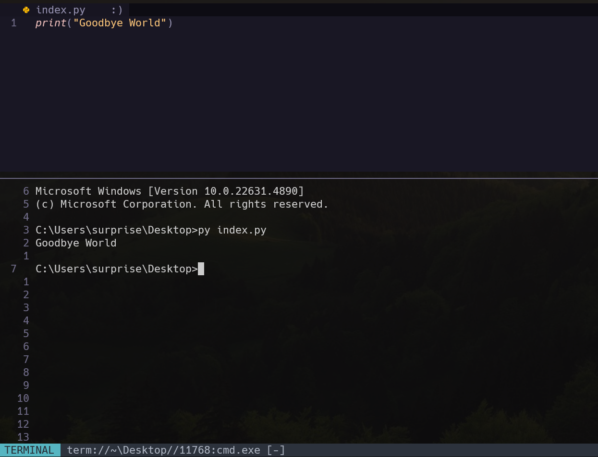

# 🎩 SurpriseVim – The Ultimate Neovim Experience

Welcome to **SurpriseVim** – a blazing-fast, power-packed Neovim configuration designed for productivity, efficiency, and pure coding joy. Whether you're a seasoned developer or a Neovim enthusiast, this setup will **surprise** you with its speed and capabilities! 🚀

---

## 🌟 Why SurpriseVim?

🔥 **Lightning-Fast Performance** – Minimal bloat, maximum speed. Optimized for efficiency and smooth workflow.  
📌 **Feature-Rich Setup** – Packed with the best plugins to enhance your coding experience.  
🎨 **Sleek UI & Customization** – A well-polished UI with beautiful statuslines, buffers, and floating terminals.  
🎯 **Perfectly Configured Relative Line Numbers** – Stay focused and move around effortlessly.  
🛠 **Seamless Plugin Management** – Powered by `packer.nvim` for easy customization and extension.  

---

## ⚡ Core Features & Plugins

🔹 **Plugin Manager** – [packer.nvim](https://github.com/wbthomason/packer.nvim) keeps your plugins in check.  
🔹 **File Navigation** – [telescope.nvim](https://github.com/nvim-telescope/telescope.nvim) makes fuzzy searching a breeze.  
🔹 **Syntax Highlighting & Code Parsing** – [nvim-treesitter](https://github.com/nvim-treesitter/nvim-treesitter) ensures a modern, crisp coding experience.  
🔹 **Project Navigation** – [harpoon](https://github.com/ThePrimeagen/harpoon) for lightning-fast buffer and file switching.  
🔹 **Undo History** – [undotree](https://github.com/mbbill/undotree) for visualizing undo history like a time machine.  
🔹 **Git Integration** – [fugitive.vim](https://github.com/tpope/vim-fugitive) for powerful Git commands inside Neovim.  
🔹 **File Explorer** – [nvim-tree.lua](https://github.com/nvim-tree/nvim-tree.lua) provides a clean, fast file browsing experience.  
🔹 **Floating Terminal** – [vim-floaterm](https://github.com/voldikss/vim-floaterm) for smooth terminal management.  
🔹 **Code Snippets** – [LuaSnip](https://github.com/L3MON4D3/LuaSnip) for blazing-fast snippets.  
🔹 **Bufferline Navigation** – [bufferline.nvim](https://github.com/akinsho/bufferline.nvim) for seamless tab management.  
🔹 **Elegant Statusline** – [lualine.nvim](https://github.com/nvim-lualine/lualine.nvim) keeps track of everything in style.  

---

## 📂 Installation

Clone the repository into your Neovim config directory:

```bash
git clone https://github.com/yourusername/SurpriseVim ~/.config/nvim
```

Then, install the plugins inside Neovim:

```vim
:PackerSync
```

Make sure you have Neovim (v0.9+), ripgrep, and Node.js installed for full functionality.

---

## 🎨 Screenshots

  
  
  

---

## 🔥 Keybindings & Usage

| Shortcut     | Description                    |
| ------------ | ------------------------------ |
| `<Leader>pf` | Open Telescope file finder     |
| `<Leader>ps` | Live grep with Telescope       |
| `<C-e>`      | Open Harpoon quick menu        |
| `<Leader>a`  | Add file to Harpoon            |
| `<Leader>gs` | Git commands with Fugitive     |
| `<Leader>nn` | Toggle Nvim-Tree               |
| `<Leader>fj` | Open floating terminal         |

More custom keybindings can be found in the config files!

---

## 🛠 Requirements

- **Neovim v0.9+**
- **ripgrep** (for Telescope fuzzy searching)
- **fzf** (optional but recommended)
- **Node.js** (for LSP support)
- **Git** (for plugin installation & version control)

---

## 🤝 Contributions & Customization

Feel free to fork and tweak SurpriseVim to your heart's content! Submit a PR if you have awesome ideas to improve the setup. 🚀

---

## 🐝 Special Thanks

A huge thanks to [**ThePrimeagen**](https://github.com/ThePrimeagen) for his incredible Neovim tutorials and inspiration.  
Also, a special shoutout to my mentor[ **Jamolhon Akhmedov**](https://github.com/jamolxon) for guiding me on my journey.  

---

## 🐝 License

This configuration is open-source under the MIT License. Use it, modify it, and make it your own!

---

> **💡 Get ready to be surprised by Neovim!** ✨

